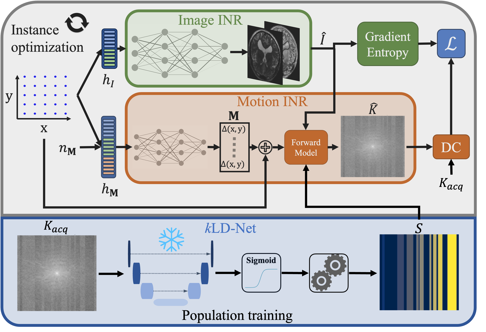
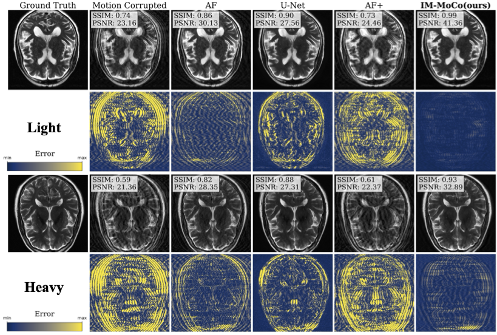

# IM-MoCo

Official PyTorch implementation of: **Ziad Al-Haj Hemidi**, Christian Weihsbach, Mattias P. heinrich, "*IM-MoCo: Self-supervised MRI Motion Correction using Motion-Guided Implicit Neural Representations*", **MICCAI** (2024)

[Paper](files/MICCAI24_20240307_final.pdf) | [Supplementary Material](files/MICCAI24_20240307_Supplementary.pdf)

<!-- | [Project Page]() -->

## Introduction

In this work, we propose a self-supervised MRI motion correction method that leverages motion-guided implicit neural representations to learn the motion patterns and correct the motion artifacts in MRI scans. The pre-trained klD-Net takes a motion-corrupted k-space
and outputs a motion mask, which is post-processed to yield a list of movement groups
indicated by the different colors in $S$. The number of movements $n_\textbf{M}$
and corresponding lines guide the Motion INR and the Image INR. The Image INR
predicts the motion-free image and the Motion INR is used for guidance by optimizing
the forward motion yielding a motion-corrupted k-space. The discrepancy between the
motion-corrupted and the measured k-space is minimized using the data-consistency
(DC) loss. The gradient entropy is a denoiser on the Image-INR output to impose crisp
image priors. The final motion-corrected image is the output of the Image INR.



## Example Results

We assess the Image quality of the motion correction compared to state-of-the-art methods for two motion scenarios.



## Installation

### Requirements

- Python
- PyTorch
- torchvision
- h5py
- numpy

See the `requirements.txt` file for the full list of dependencies.

### Setup environment

Create a new conda environment and activate it:

```bash
 mamba env create -n immoco python=3.10
 mamba activate immoco
```

Install the required packages:

```bash
pip install -r requirements.txt
```

For Hash-grid encoding we need to install [tiny-cuda](https://github.com/NVlabs/tiny-cuda-nn/#subdirectory=bindings/torch) in the activated environment as well:

```bash
pip install git+https://github.com/NVlabs/tiny-cuda-nn/#subdirectory=bindings/torch
```

## Usage

### Dataset

- Download the NYU [fastMRI](https://fastmri.med.nyu.edu) $T_2$\_weighted Brain dataset.
- Run the following scripts to prepare the datasets(Todo: 🚧 Under construction 🚧):

```bash
python src/utils/prepareData.py
```

## Train

For training, please refer to the `src/train` folder and, for example, run:

```bash
python src/train/train_kld_net.py
```

## Pre-trained Models

Pre-trained models can be downloaded using the download script:

```bash
python src/utils/download_pretrained_models.py
```

This will download the pre-trained models to the `models` directory.

Note: IM-MoCo (ours) has no pre-trained weights since it is an instance-based method.

## Test

To run tests please run the scripts under `src/test` as follows:

```bash
python src/test/test_immoco.py
```

## Citation (Placeholder)

If you find this work helpful for your research, please cite the following paper:

```bibtex
@inproceedings{IM-MoCo,
  title={IM-MoCo: Self-supervised MRI Motion Correction using Motion-Guided Implicit Neural Representations},
  author={Ziad Al-Haj Hemidi and Christian Weihsbach and Mattias P. Heinrich},
  booktitle={MICCAI},
  year={2024}
}
```

## License

This project is licensed under the MIT License - see the [LICENSE](LICENSE) file for details.
